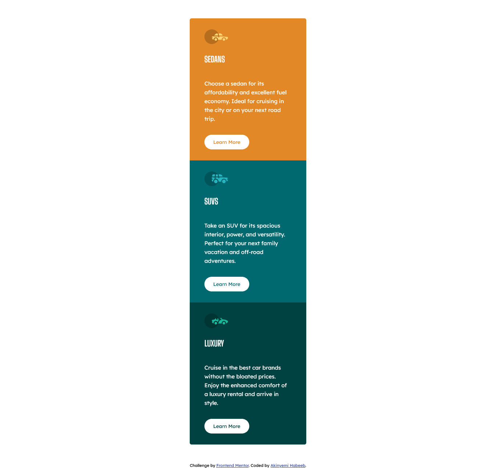

# Frontend Mentor - 3-column preview card component solution

This is a solution to the [3-column preview card component challenge on Frontend Mentor](https://www.frontendmentor.io/challenges/3column-preview-card-component-pH92eAR2-). Frontend Mentor challenges help you improve your coding skills by building realistic projects. 

## Table of contents

- [Overview](#overview)
  - [The challenge](#the-challenge)
  - [Screenshot](#screenshot)
  - [Links](#links)
  - [Built with](#built-with)
  - [What I learned](#what-i-learned)
  - [Continued development](#continued-development)
- [Author](#author)
- [Acknowledgments](#acknowledgments)

## Overview
- This is a 3-column preview card component challenge on Frontend Mentor aimed at helping newbie developers get familiar with layouts.

### The challenge

Users should be able to:

- View the optimal layout depending on their device's screen size
- See hover states for interactive elements

### Screenshot

### Links

- Solution URL: [Soluion URL](https://github.com/Akinyemi4/3-column-preview-card-component-main-akinyemi4)
- Live Site URL: [Live Site URL](https://3-column-preview-card-component-main-akinyemi4.netlify.app/)

### Built with

- Semantic HTML5 markup
- CSS custom properties
- Flexbox

### What I learned

- In this challenge I didn't gain new things compared to others but I found it interesting because it's the first challenge I approached the challenge using the mobile view as the base then to desktop.

### Continued development
- What I'm looking forward to presently is to increase my speed of getting solutions and figuring things out.

## Author
- Frontend Mentor - [@Akinyemi4](https://www.frontendmentor.io/profile/Akinyemi4)

## Acknowledgments

- Huge thanks to frontendmentor.io for giving developers generally and newbies specifically an avenue to increase their coding and problem-solvivg skill.
